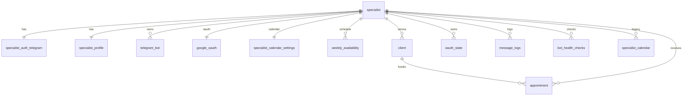

# Database schema (source-aligned)

Источник истины:
- ORM-модели: `database.py`.
- SQL-миграции: `scripts/migrations/*.sql`.

> В `public` ожидаются таблицы: `applied_migrations`, `appointment`, `bot_health_checks`, `client`, `google_oauth`, `message_logs`, `oauth_state`, `service_heartbeats`, `specialist`, `specialist_auth_telegram`, `specialist_calendar`, `specialist_calendar_settings`, `specialist_profile`, `telegram_bot`, `weekly_availability`.

## Relationships (FK)
- `appointment.specialist_id -> specialist.specialist_id`
- `appointment.client_id -> client.client_id`
- `bot_health_checks.specialist_id -> specialist.specialist_id`
- `client.specialist_id -> specialist.specialist_id`
- `google_oauth.specialist_id -> specialist.specialist_id`
- `message_logs.specialist_id -> specialist.specialist_id` (nullable)
- `oauth_state.specialist_id -> specialist.specialist_id`
- `specialist_auth_telegram.specialist_id -> specialist.specialist_id`
- `specialist_calendar_settings.specialist_id -> specialist.specialist_id`
- `specialist_profile.specialist_id -> specialist.specialist_id`
- `telegram_bot.specialist_id -> specialist.specialist_id` (nullable)
- `weekly_availability.specialist_id -> specialist.specialist_id`
- `specialist_calendar.specialist_id -> specialist.specialist_id` (legacy table на проде)

## Tables

### 1) applied_migrations
Назначение: журнал применённых SQL-миграций.
- Поля: `filename text not null`, `applied_at timestamptz not null default now()`.
- PK/UQ/IDX: зависит от DDL инструмента (обычно `filename` unique/PK).

### 2) specialist
- Поля: `specialist_id uuid not null`, `status enum not null`, `created_at timestamptz default now()`, `updated_at timestamptz default now()`, `onboarding_master_completed_at timestamptz null`, `onboarding_personal_completed_at timestamptz null`.
- PK: `specialist_id`.
- FK: —.
- UQ: —.
- IDX: индекс по `status` из ORM не объявлен.

### 3) specialist_auth_telegram
- Поля: `specialist_id uuid not null`, `tg_user_id bigint not null`, `tg_username varchar null`, `tg_first_name varchar null`, `tg_last_name varchar null`, `created_at timestamptz default now()`.
- PK: `specialist_id`.
- FK: `specialist_id -> specialist.specialist_id`.
- UQ: `tg_user_id`.
- IDX: implicit по PK/UQ.

### 4) specialist_profile
- Поля: `specialist_id uuid not null`, `public_name text not null`, `owner_tg_user_id bigint not null`, `owner_tg_username varchar null`, `specialist_timezone varchar not null`, `session_duration_min int not null default 60`, `session_buffer_min int not null default 0`, `max_sessions_per_day int not null default 4`, `slot_step_min int not null default 15`, `cancel_window_hours int not null default 12`, `created_at timestamptz default now()`, `updated_at timestamptz default now()`.
- PK: `specialist_id`.
- FK: `specialist_id -> specialist.specialist_id`.
- UQ: —.
- IDX: `owner_tg_user_id`.
- CHECK: `session_duration_min`, `session_buffer_min`, `max_sessions_per_day`, `slot_step_min` диапазоны.

### 5) telegram_bot
- Поля: `telegram_bot_id uuid not null`, `specialist_id uuid null`, `bot_user_id bigint not null`, `bot_username varchar not null`, `bot_name varchar not null`, `bot_token_encrypted text not null`, `webhook_secret text not null`, `webhook_url text not null`, `status enum not null`, `created_at timestamptz default now()`, `updated_at timestamptz default now()`.
- PK: `telegram_bot_id`.
- FK: `specialist_id -> specialist.specialist_id`.
- UQ: `bot_user_id`.
- IDX: `specialist_id`.

### 6) google_oauth
- Поля: `specialist_id uuid not null`, `refresh_token_encrypted text not null`, `scopes text not null`, `status enum not null default connected`, `token_updated_at timestamptz not null`, `created_at timestamptz default now()`, `updated_at timestamptz default now()`.
- PK: `specialist_id`.
- FK: `specialist_id -> specialist.specialist_id`.
- UQ/IDX: implicit PK.

### 7) specialist_calendar_settings
- Поля: `specialist_id uuid not null`, `calendar_id varchar not null`, `calendar_summary varchar null`, `calendar_time_zone varchar null`, `source enum not null`, `last_smoke_test_at timestamptz null`, `last_smoke_test_status varchar(32) null`, `last_smoke_test_error varchar(255) null`, `created_at timestamptz default now()`, `updated_at timestamptz default now()`.
- PK: `specialist_id`.
- FK: `specialist_id -> specialist.specialist_id`.
- UQ: `calendar_id`.
- IDX: `calendar_id`.

### 8) specialist_calendar (legacy)
- Поля/ограничения зависят от более ранней схемы, таблица может присутствовать на проде.
- Используется только для совместимости/диагностики; актуальная рабочая таблица — `specialist_calendar_settings`.

### 9) weekly_availability
- Поля: `weekly_availability_id uuid not null`, `specialist_id uuid not null`, `weekday int not null`, `is_working bool not null default false`, `interval_1_start time null`, `interval_1_end time null`, `interval_2_start time null`, `interval_2_end time null`, `interval_3_start time null`, `interval_3_end time null`, `updated_at timestamptz default now()`.
- PK: `weekly_availability_id`.
- FK: `specialist_id -> specialist.specialist_id`.
- UQ: не объявлен в ORM.
- IDX: `specialist_id`.
- CHECK: парность и порядок интервалов (`start < end` при заполнении).

### 10) client
- Поля: `client_id uuid not null`, `specialist_id uuid not null`, `tg_user_id bigint not null`, `tg_username varchar null`, `display_name varchar null`, `client_code varchar not null`, `client_timezone varchar not null`, `timezone_source enum not null`, `created_at timestamptz default now()`, `updated_at timestamptz default now()`.
- PK: `client_id`.
- FK: `specialist_id -> specialist.specialist_id`.
- UQ: `uq_client_specialist_tg_user_id (specialist_id, tg_user_id)`.
- IDX: `specialist_id`, `tg_user_id`.

### 11) appointment
- Поля: `appointment_id uuid not null`, `specialist_id uuid not null`, `client_id uuid not null`, `start_at_utc timestamptz not null`, `end_at_utc timestamptz not null`, `booking_state enum not null`, `idempotency_key varchar not null`, `gcal_event_id varchar null`, `specialist_private_note text null`, `failure_message text null`, `created_at timestamptz default now()`, `updated_at timestamptz default now()`.
- PK: `appointment_id`.
- FK: `specialist_id -> specialist.specialist_id`, `client_id -> client.client_id`.
- UQ: `idempotency_key`.
- IDX: `booking_state`, `ix_appointment_specialist_id_start_at_utc (specialist_id, start_at_utc)`, `ix_appointment_specialist_id_booking_state_start_at_utc (specialist_id, booking_state, start_at_utc)`, `ix_appointment_client_id_start_at_utc (client_id, start_at_utc)`.

### 12) oauth_state
- Поля: `oauth_state_id uuid not null`, `state varchar not null`, `type enum not null`, `specialist_id uuid not null`, `expires_at timestamptz not null`, `created_at timestamptz default now()`.
- PK: `oauth_state_id`.
- FK: `specialist_id -> specialist.specialist_id`.
- UQ: `state`.
- IDX: `expires_at`.

### 13) message_logs
- Поля: `id uuid not null`, `created_at timestamptz default now()`, `specialist_id uuid null`, `bot_id bigint not null`, `bot_username varchar null`, `specialist_name varchar null`, `tg_user_id bigint not null`, `user_handle varchar null`, `direction enum not null`, `message_type varchar not null`, `content text null`, `fsm_state varchar null`, `handler_name varchar null`, `is_error bool default false`, `error_details text null`, `processing_time float null`.
- PK: `id`.
- FK: `specialist_id -> specialist.specialist_id`.
- UQ: —.
- IDX: `bot_id`.

### 14) bot_health_checks
- Поля: `id uuid not null`, `specialist_id uuid not null`, `bot_user_id bigint not null`, `checked_at timestamptz default now()`, `status enum not null`, `latency_ms int not null`, `error_details text null`.
- PK: `id`.
- FK: `specialist_id -> specialist.specialist_id`.
- UQ: —.
- IDX: `specialist_id`, `bot_user_id`.

### 15) service_heartbeats
- Поля: `id uuid not null`, `service_name text not null`, `ts timestamptz default now()`, `db_ok bool not null`, `loop_ok bool not null`, `latency_ms int not null`, `details text null`.
- PK: `id`.
- FK/UQ: —.
- IDX: нет явных.

## Mermaid ER diagram



## Как проверить актуальную схему на сервере

```sql
-- список таблиц public
SELECT table_name
FROM information_schema.tables
WHERE table_schema='public'
ORDER BY table_name;

-- поля, nullability, default
SELECT table_name, column_name, data_type, is_nullable, column_default
FROM information_schema.columns
WHERE table_schema='public'
ORDER BY table_name, ordinal_position;

-- PK/FK/UQ
SELECT tc.table_name, tc.constraint_name, tc.constraint_type, kcu.column_name,
       ccu.table_name AS foreign_table_name, ccu.column_name AS foreign_column_name
FROM information_schema.table_constraints tc
LEFT JOIN information_schema.key_column_usage kcu
  ON tc.constraint_name = kcu.constraint_name AND tc.table_schema = kcu.table_schema
LEFT JOIN information_schema.constraint_column_usage ccu
  ON tc.constraint_name = ccu.constraint_name AND tc.table_schema = ccu.table_schema
WHERE tc.table_schema = 'public'
ORDER BY tc.table_name, tc.constraint_type, tc.constraint_name;

-- индексы
SELECT schemaname, tablename, indexname, indexdef
FROM pg_indexes
WHERE schemaname='public'
ORDER BY tablename, indexname;
```

## Как поддерживать документ актуальным
1. Изменили модель в `database.py` или миграцию в `scripts/migrations/*`.
2. Сверили схему SQL-запросами выше на dev/stage/prod.
3. Обновили этот файл и разделы про reset-алгоритм/таблицы в документации.
