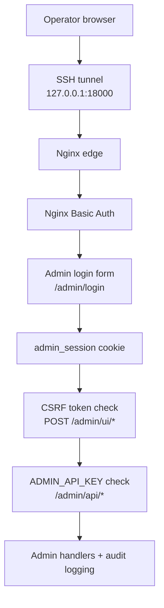

# US-AD-9 — Admin Console Security Hardening

Status: Planned

## User Story

As super_admin
I want additional security protection for Admin Console
So that internal admin endpoints cannot be brute-forced or discovered.

## Scope

Infrastructure hardening for admin entrypoints (no application logic changes):

- `/admin`
- `/admin/*`
- `/admin/ui/*`
- `/admin/api/*`

## Security Architecture

Defense-in-depth layers for Admin Console:

1. **SSH tunnel (preferred access)**
2. **Nginx Basic Auth**
3. **Admin login form** (`/admin/login`)
4. **`admin_session` cookie authentication**
5. **CSRF protection** (POST)
6. **`ADMIN_API_KEY`** (JSON API)

### Architecture Diagram

## Nginx Implementation

### 1) Rate-limit zones (http context)

Use `deploy/nginx/admin_rate_limit.conf` in nginx `http {}` context.

- `admin_console_per_ip`: baseline throttling for `/admin*`
- `admin_login`: strict throttling for `/admin/login`

### 2) Admin server protection (server context)

Use `deploy/nginx/admin_basic_auth.conf` inside target `server {}`.

This snippet enforces:

- Basic Auth on all admin routes
- dedicated brute-force limits on `/admin/login`
- proxying to backend only after edge checks

## Brute-force protection

Brute-force mitigation is applied on two levels:

- **Global admin pressure control**: `60 req/min/IP` for `/admin*`
- **Login endpoint protection**: `10 req/min/IP` for `/admin/login`, with low burst

## Acceptance Criteria

- `/admin*` routes require Nginx Basic Auth before reaching backend
- Brute-force attempts are throttled by Nginx rate limits
- Admin UI remains accessible via SSH tunnel
- No changes in application logic

## QA Check

Manual smoke test via SSH tunnel:

1. Establish tunnel to the server and bind local admin port:
   - `ssh -L 18000:127.0.0.1:80 <user>@<host>`
2. Open:
   - `http://127.0.0.1:18000/admin`
3. Validate:
   - no credentials → `401 Unauthorized`
   - valid Basic Auth → admin login form renders
   - repeated login attempts trigger `429 Too Many Requests`

## Operational Notes

- Keep htpasswd file on server only: `/etc/nginx/.htpasswd_admin`
- Rotate Basic Auth credentials periodically
- Keep Nginx access logs enabled for admin locations to support incident review
